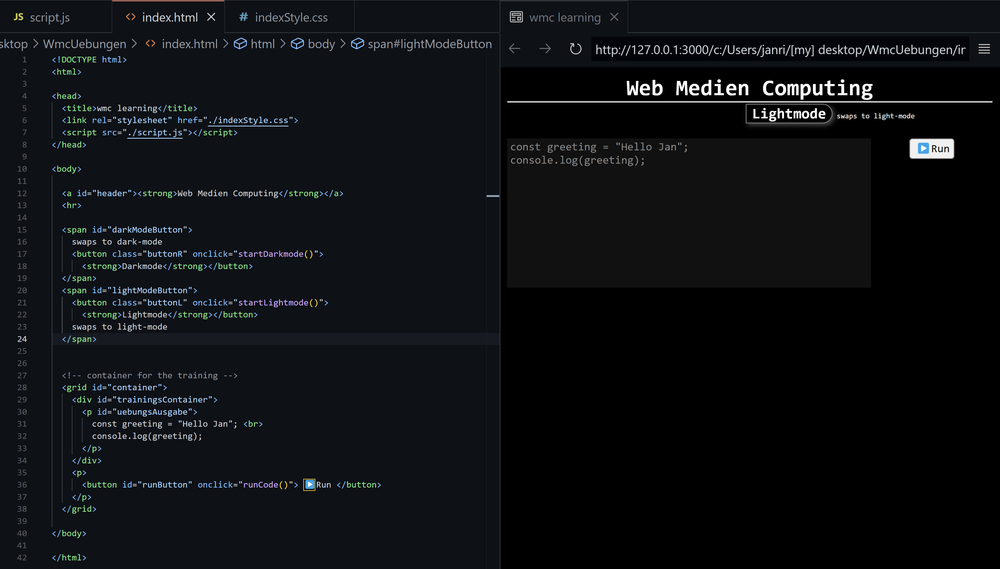

###### 
 WmcUebung-006 

# Uniform Resource Identifiers
> A ***URI***, or ***U***niform ***R***esource ***I***dentifier, is a unique character sequence that identifies a resource that is *(almost
always)* accessed via the internet.

  
  

#### *URLs are only one kind of URI*

---

## URL

- ### URL Parts and Their Descriptions

  
  

---

- ### URL Paths
  On static sites (like blogs or documentation sites) a URL's path mirrors the server's filesystem hierarchy.  

  ##### For example: 
    > *if* the website [`https://exampleblog.com`](https://exampleblog.com) had a **static web server** running in its `/home` directory,  
    > then a **request** to [`https://exampleblog.com/site/index.html`](https://exampleblog.com/site/index.html) would *probably* **return** the **file** located **at `/home/site/index.html`**.  

  ***
 But technically, this is just a convention.
***
  > *The server could be configured to return any file or data given that path.*  

  - Paths in ***URL***s are essentially just another *type of parameter that can be passed to the server when making a request*.  
  - For dynamic sites and web applications, the path is often used to denote a specific resource or endpoint.
 
---

  
<!--
- ### *To test my javascript skills i first made myself a "playground environment"*:

  
  

---
- ## *Overview of the .html "playground"-file*

  
  

- ## *Overview of the .js "playground"-file*

  

-->
---
